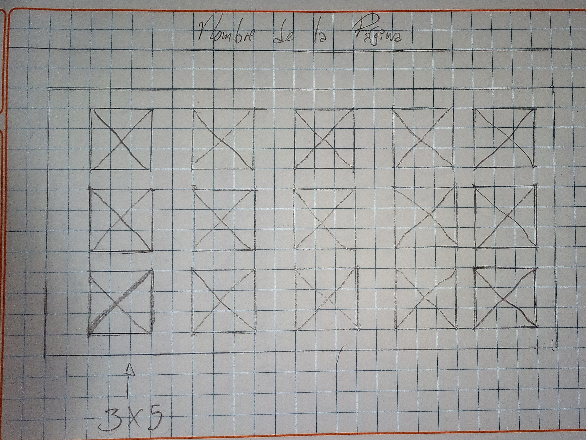
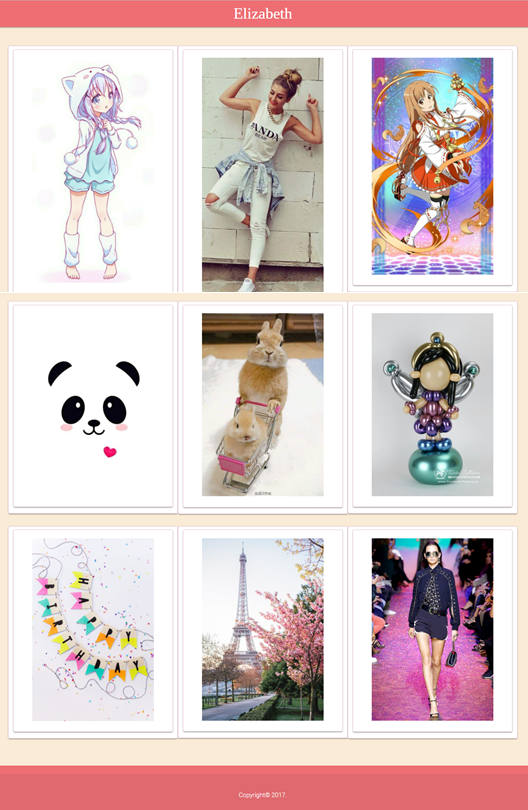

# Cardify

[](http://forthebadge.com)
[](http://forthebadge.com)
[](http://forthebadge.com)
[](http://forthebadge.com)
[](http://forthebadge.com)
[](http://forthebadge.com)
[](http://forthebadge.com)

* **Track:** _Common Core_
* **Curso:** _JS Deep Dive: Crea tu propia librería usando JavaScript_
* **Unidad:** _Producto final_

***

## **Objetivo**

Implementar un plugin de jQuery que dado un _contenedor_ debe buscar todas las
imágenes que encuentre dentro del _contenedor_ y reemplazarlas por un nuevo
elemento `<figure>` que contenga la imagen (``) además de un `<figcaption>`
con el texto del atributo `alt` de la imagen.

## **Herramientas Tecnológicas**

* HTML 5

* CSS 3

* Framework Materialize

* Librería jQuery

* Javascript

* Babel

* Node.js

* Guía de Estilos(`.eslintrc`)

## **Getting Started**

### **Estructura de Carpetas**

```bash
Proyecto
├── public/
│   ├── assets/
│   │   ├── images/
│   │   ├── // Imágenes
│   │
│   ├── css/
│   │   ├── main.css
│   │
│   ├── js/
│   │   ├── app.js(ES5)
│   │   └── index.js(ES5)
│   │
│   ├── index.html
│   │
│   └── vendors/
│       ├── jquery
│       │   ├── jquery-3.2.1.min.js
│       │
│       ├── materialize││framework de tu elección
│
├── src/
│   ├── app.js(ES6)
│   ├── index.js(ES6)
│
├── README.md
│
├── .gitignore
│
├── package.json
│
└── .eslintrc

```

Para incluir este plugin a tu proyecto, inserta el archivo `index.js` en una etiqueta script en tu archivo HTML:

```bash
<script src="vendors/jquery/jquery-3.2.1.min.js"></script>
<script src="vendors/materialize/js/materialize.min.js"></script>
<script src="js/index.js"></script>
<script src="js/app.js"></script>
```

### **Inicializando con jQuery**

```bash
$('img').cardify();
```

## **Flujo de trabajo**

1. Se realizó un [**fork**](https://gist.github.com/ivandevp/1de47ae69a5e139a6622d78c882e1f74)
   del repositorio brindado por `Laboratoria`.

## **Planificación**

1. Semana 1 - días:

  - **Miércoles 24**: Tomar decisiones del reto a desarrollar.
    - Encargadas: Araceli y Lesly.
    - Resultado: Se determinó por unanimidad realizar el reto 2 - Cardify.

  - **Jueves 25**: Investigación del material a utilizar, como son los issues y milestones.
    - Encargadas: Araceli y Lesly.

  - **Viernes 26**: Iniciamos la estructura del reto elegido y se hizo la asignación de tareas aplicando el issues.
    - Encargadas: Araceli y Lesly
    - Resultado: Planificación parte 1, se puede observar dándole click en el siguiente enlace: [Issue 1](https://github.com/AraceliGS/cardify/issues/1).

  - **Sábado 27**: Se realizó la maquetación, asignación de tareas del día, se añadieron los archivos package.json y .gitignore.
    - Encargadas: Araceli y Lesly
    - Resultado: 
      - Scketch inicial.
      - Estructura inicial y estilos.
      - Asignación de tareas empleando issues, Planificación - parte 2: [Issue 2](https://github.com/AraceliGS/cardify/issues/3).
      - Primera versión de nuestro archivo package.json.
      - Primera actualización del archivo README.md.
      - Investigación de plugin.

2. Semana 2 - días:

  - **Lunes 29, Martes 30, Miércoles 31**: Se dió el término de la funcionalidad y estilos al plugin, reestructuración de archivos y carpetas con uso del transpilador Babel, actualizacición del archivo README.md, actualización de issues.
    - Encargadas: Araceli y Lesly

## **Anexos**

### **Scketch**



## **Resultado Final**

